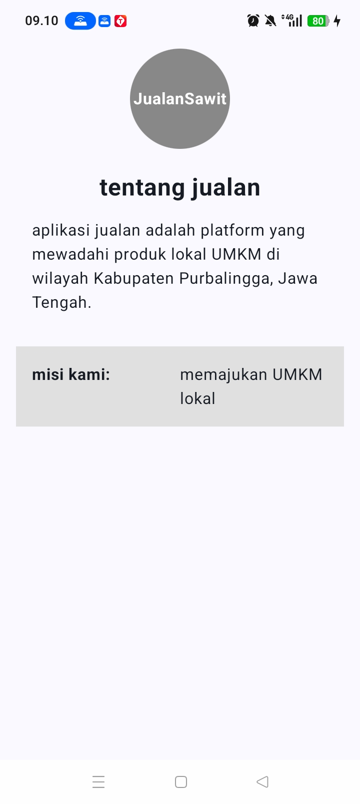
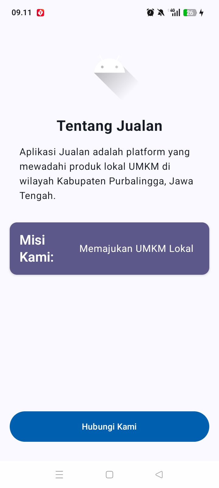
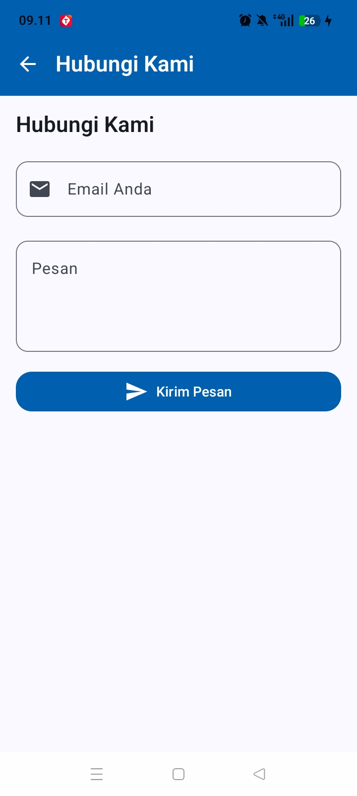

# Praktikum Pemrograman Mobile - Jetpack Compose

Repository ini berisi hasil praktikum Pemrograman Mobile menggunakan **Kotlin** dan **Jetpack Compose**.

---

## 📌 Pertemuan 1: Desain & Tampilan Awal UI "Tentang Jualan"

### 🖼️ Hasil Tampilan Pertemuan 1


### 📝 Penjelasan Singkat
Pada Pertemuan 1, dibuat tampilan dasar untuk informasi aplikasi dengan komponen UI sederhana:
- **Logo & Header**: Menampilkan logo melingkar **JualanSawit** pada bagian atas layar.
- **Judul Layar**: Teks judul **"tentang jualan"**.
- **Deskripsi**: Deskripsi singkat mengenai platform yang mewadahi produk lokal UMKM di Kabupaten Purbalingga, Jawa Tengah.
- **Kartu Misi**: Blok informasi bertuliskan **"misi kami: memajukan UMKM lokal"**.

---

## 📌 Pertemuan 2: Styling Material 3, Navigasi, & Form Hubungi Kami

### 🖼️ Hasil Tampilan Pertemuan 2

<p align="center">
  
  &nbsp;&nbsp;
  
</p>

### 📝 Penjelasan Singkat

1. **Layar Utama (`BasicInfoScreen`)**:
   - **Icon & Logo**: Pembaruan logo Android di bagian atas.
   - **Teks Informasi**: Judul **"Tentang Jualan"** dan deskripsi platform UMKM.
   - **Card Misi**: Menggunakan `Card` Material 3 berwarna *tertiary* dengan tulisan **"Misi Kami: Memajukan UMKM Lokal"**.
   - **Tombol Navigasi**: Tombol biru di bagian bawah **"Hubungi Kami"** untuk berpindah ke layar formulir.

2. **Layar Formulir (`HubungiKamiScreen`)**:
   - **TopAppBar**: Bilah navigasi biru dengan ikon kembali (*Back Arrow*) dan judul **"Hubungi Kami"**.
   - **Input Email**: Field `OutlinedTextField` berlabel **"Email Anda"** dilengkapi dengan ikon email.
   - **Input Pesan**: Field `OutlinedTextField` berukuran lebih luas untuk menginput pesan dari pengguna.
   - **Tombol Kirim**: Tombol biru bertuliskan **"Kirim Pesan"** dilengkapi dengan ikon kirim (*Send Icon*).

---

## 📁 Struktur Proyek

```text
PraktikkumMobile/
├── docs/                             # Gambar screenshot per pertemuan
│   ├── pertemuan1_tentang_jualan.jpeg
│   ├── pertemuan2_basic_info.jpeg
│   └── pertemuan2_hubungi_kami.jpeg
└── app/src/main/java/com/example/praktikkummobile/
    ├── MainActivity.kt               # Entry point & NavHost setup
    └── ui/
        ├── screen/
        │   ├── BasicInfoScreen.kt   # Layar Info Utama
        │   └── HubungiKamiScreen.kt # Layar Form Kontak
        └── theme/                   # Tema & Warna Material 3
```
