# Laporan Praktikum Pemrograman Mobile

**Nama**        : Afkar Aufaa Farros  
**NIM**         : H1D024085  
**Shift**       : Awal E / Akhir C  
**Praktikum**   : Pemrograman Mobile

---

## 📝 Tugas Pertemuan 1
**Tanggal**: Selasa, 1 September 2026

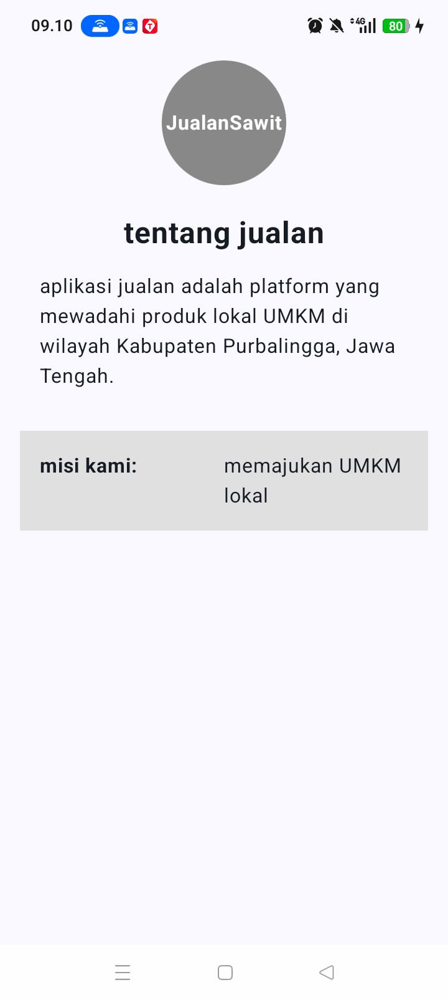

**Kesimpulan Praktikum:**  
Pada pertemuan pertama, praktikum memberikan pemahaman dasar mengenai konsep pengembangan antarmuka secara deklaratif menggunakan **Jetpack Compose**. Mahasiswa mempelajari penggunaan komponen UI dasar seperti `Text`, `Image`, `Column`, `Row`, `Spacer`, dan `Card` untuk menyusun tata letak halaman informasi dasar aplikasi (*Tentang Jualan*).

---

## 📝 Tugas Pertemuan 2
**Tanggal**: Selasa, 8 September 2026

  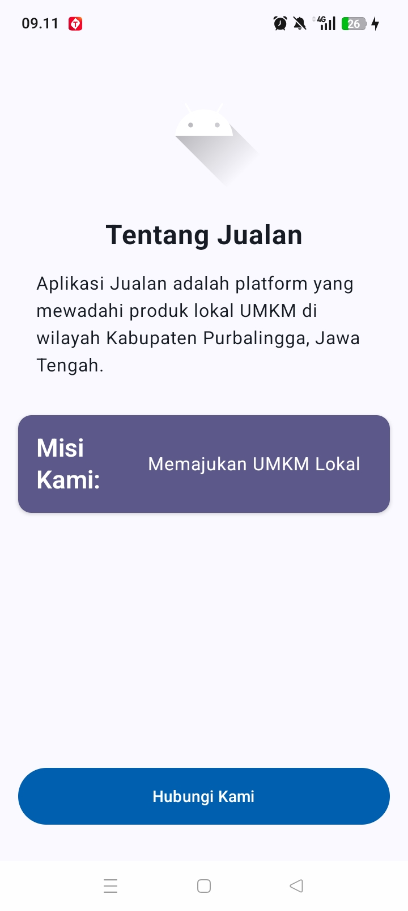
  &nbsp;&nbsp;
  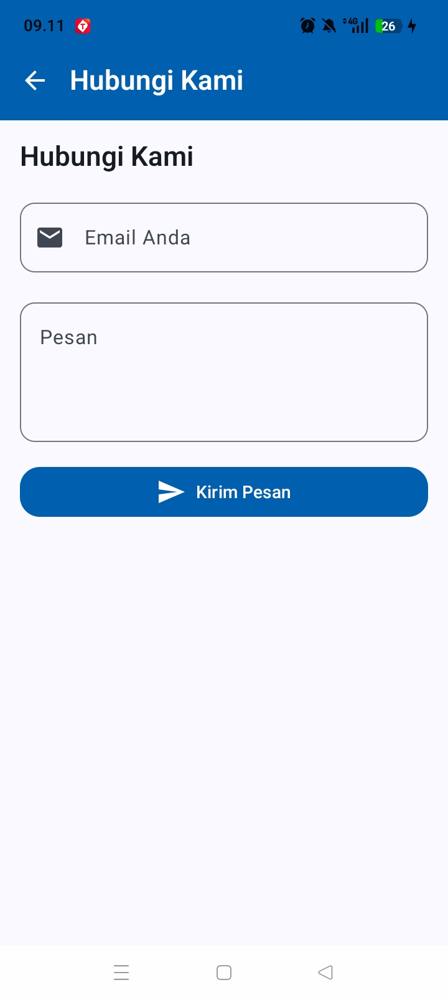

**Kesimpulan Praktikum:**  
Pertemuan kedua berfokus pada implementasi navigasi antar layar dan formulir interaktif. Mahasiswa mempelajari penggunaan **Jetpack Navigation Compose** (`NavHost` & `NavController`), struktur layout `Scaffold` dengan `TopAppBar`, serta komponen input data seperti `OutlinedTextField` dan `Button` pada halaman formulir kontak (*Hubungi Kami*).

---

## 📝 Tugas Pertemuan 3
**Tanggal**: Selasa, 15 September 2026

  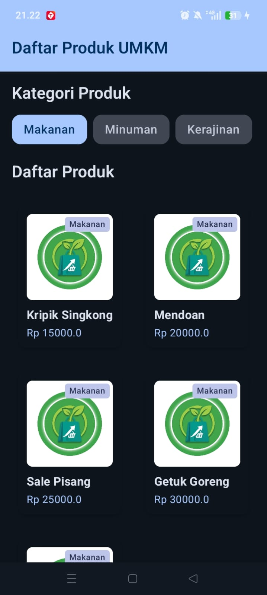
  &nbsp;&nbsp;
  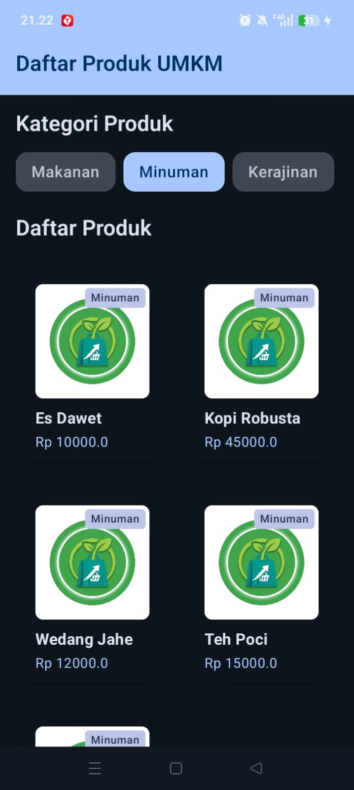
  &nbsp;&nbsp;
  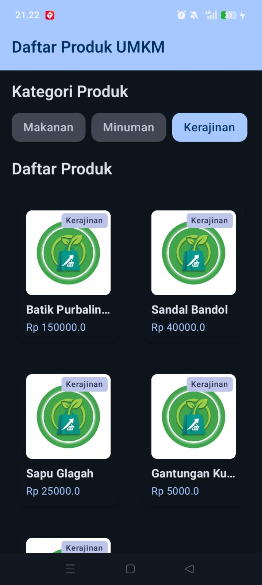

**Kesimpulan Praktikum:**  
Pertemuan ketiga membahas pengelolaan data terstruktur dan antarmuka berbasis daftar/grid dinamis. Mahasiswa mempelajari pembuatan model data (`Category` & `Product`), pemanfaatan *dummy data*, pembuatan komponen berulang menggunakan `LazyRow` untuk filter kategori dan `LazyVerticalGrid` untuk daftar produk, serta penerapan *state management* (`remember` & `mutableStateOf`).

---

## 📝 Tugas Pertemuan 4
**Tanggal**: Selasa, 22 September 2026

  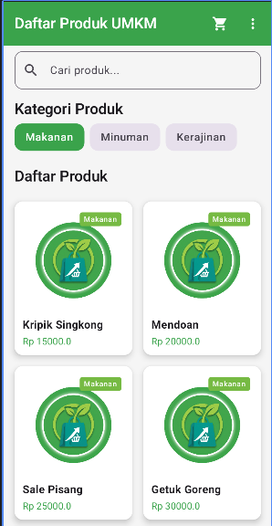
  &nbsp;&nbsp;
  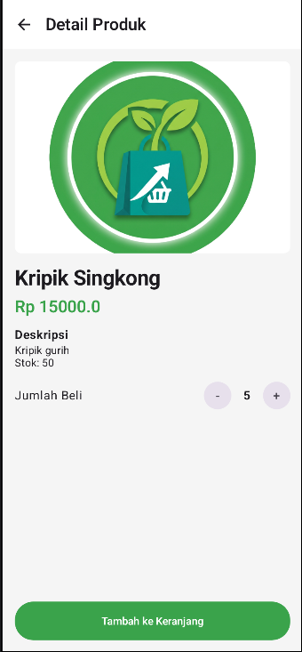
  &nbsp;&nbsp;
  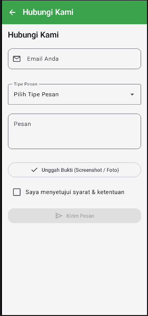

**Kesimpulan Praktikum:**  
Pertemuan keempat berfokus pada implementasi halaman detail produk (*DetailProductScreen*), navigasi dengan pengiriman argumen (*Navigation Compose Arguments*), pengelolaan state kuantitas produk, serta penyempurnaan antarmuka agar sesuai dengan standar desain material.

---

## 📝 Tugas Pertemuan 5
**Tanggal**: Selasa, 29 September 2026

  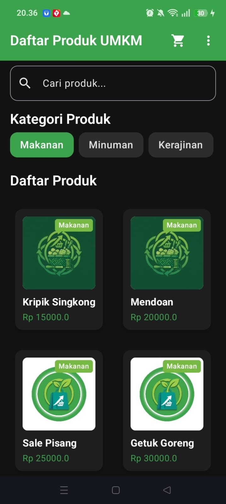
  &nbsp;&nbsp;
  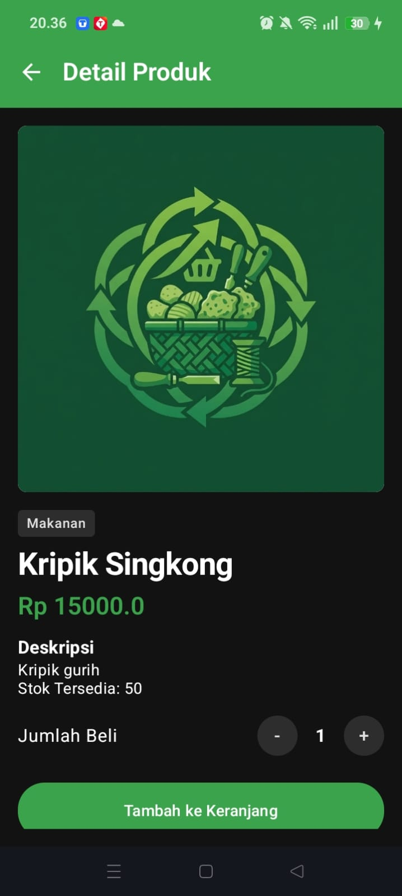

**Kesimpulan Praktikum:**  
Pertemuan kelima berfokus pada integrasi aplikasi dengan Backend API menggunakan **Retrofit**, **Coroutines**, dan **ViewModel**. Mahasiswa mempelajari cara melakukan pemanggilan jaringan (*network calls*) untuk mengambil data kategori dan produk secara asinkron, menerapkan *UI State Management* (`ProductUiState` dengan `Loading`, `Success`, dan `Error`), serta mengelola siklus hidup data dengan `StateFlow` dan `collectAsState()`.

